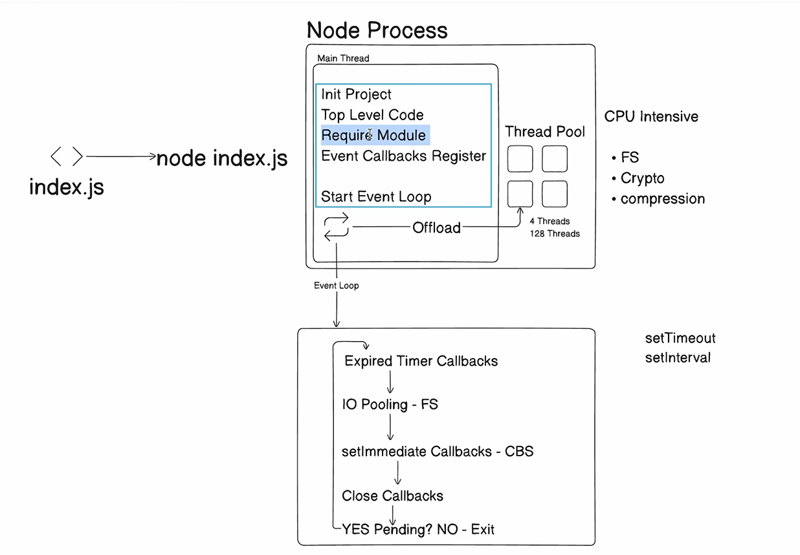

# Node.js Internals: Event Loop & Thread Pool

This document covers the internal workings of Node.js, focusing on the Event Loop phases, the relationship between timers and I/O, and the management of the Libuv Thread Pool.

**Reference:** [Node.js Event Loop, Timers, and nextTick](https://nodejs.org/en/learn/asynchronous-work/event-loop-timers-and-nexttick)

---

## 🏗️ Event Loop Phases Overview

The Event Loop is what allows Node.js to perform non-blocking I/O operations despite JavaScript being single-threaded. It consists of several distinct phases:

1.  **timers**: Executes callbacks scheduled by `setTimeout()` and `setInterval()`.
2.  **pending callbacks**: Executes I/O callbacks deferred to the next loop iteration (e.g., certain types of TCP errors).
3.  **idle, prepare**: Used only internally by Node.js.
4.  **poll**: Retrieves new I/O events and executes I/O-related callbacks. Node will block here when appropriate.
5.  **check**: `setImmediate()` callbacks are invoked here.
6.  **close callbacks**: Executes close event callbacks, e.g., `socket.on('close', ...)`.



---

## ❓ Common Questions & Examples

### Q1: `setTimeout` vs `setImmediate`

**Question:** If we have both `setTimeout(fn, 0)` and `setImmediate(fn)`, which one runs first?

**Answer:**

- **Outside an I/O cycle:** The order is non-deterministic and depends on the performance of the process.
- **Inside an I/O cycle:** `setImmediate` will always run before any timers, regardless of the timeout.
- **With Top-Level Code:** If there is synchronous code remaining, it finishes first, then the loop enters the timer phase (usually choosing `setTimeout` first if the process is fast enough).

#### Example 1: Non-deterministic behavior (No Top-Level Code)

```javascript
setTimeout(() => {
  console.log("setTimeout");
}, 0);

setImmediate(() => {
  console.log("setImmediate");
});
```

**Output (Random):**

```text
setTimeout
setImmediate
```

_(or)_

```text
setImmediate
setTimeout
```

#### Example 2: With Top-Level Code

```javascript
const fs = require("fs");

setTimeout(() => {
  console.log("setTimeout");
}, 0);

setImmediate(() => {
  console.log("setImmediate");
});

console.log("Top Level Code");
```

**Output:**

```text
Top Level Code
setTimeout
setImmediate
```

#### Example 3: Inside an I/O Callback

```javascript
const fs = require("fs");

fs.readFile(__filename, () => {
  setTimeout(() => {
    console.log("timeout");
  }, 0);
  setImmediate(() => {
    console.log("immediate");
  });
});
```

**Output:**

```text
immediate
timeout
```

---

## 🧵 Libuv Thread Pool (`UV_THREADPOOL_SIZE`)

Some Node.js APIs (like `crypto.pbkdf2` and `fs.readFile`) are not handled by the Event Loop directly but are offloaded to a thread pool managed by Libuv.

### Overriding Thread Pool Size

As discussed, you cannot reliably override `process.env.UV_THREADPOOL_SIZE` inside your script because Libuv initializes the pool before your JS code runs.

#### Correct way to set (Windows PowerShell):

```powershell
$env:UV_THREADPOOL_SIZE=2; node index.js
```

### Performance Example (2 Threads vs 6 Tasks)

```javascript
const crypto = require("crypto");
process.env.UV_THREADPOOL_SIZE = 2; // Warning: May not work internally

const fs = require("fs");
const start = Date.now();

fs.readFile("sample.txt", () => {
  console.log("IO Polling Finish - Start");

  for (let i = 1; i <= 6; i++) {
    crypto.pbkdf2("password", "salt", 100000, 1024, "sha512", () => {
      console.log(`${Date.now() - start}ms`, `Crypto Finish ${i}`);
    });
  }
});
```

**Output (with 2 threads):**
Tasks are processed in batches of 2.

```text
1100ms Crypto Finish 2
1114ms Crypto Finish 1
2461ms Crypto Finish 3
2538ms Crypto Finish 4
3829ms Crypto Finish 5
3905ms Crypto Finish 6
```

---

## 💡 What is the Ideal Thread Pool Size?

The ideal size depends on your hardware and the type of work being performed.

### 1. Identify your CPU Cores

First, find out how many logical cores you have:

```javascript
console.log(require("os").cpus().length); // Example: 8
```

### 2. General Recommendations

| Workload Type                       | Recommended Size          | Reasoning                                                                   |
| :---------------------------------- | :------------------------ | :-------------------------------------------------------------------------- |
| **CPU-Bound** (Crypto, Compressing) | `Number of Cores`         | Avoids context-switching overhead while maximizing parallel execution.      |
| **I/O-Bound** (File System, DNS)    | `Cores * 2` (or up to 16) | Threads waiting on disk are idle; extra threads allow the CPU to stay busy. |
| **Mixed**                           | `Number of Cores`         | A safe starting point for most web applications.                            |

**Important Note:** Setting the size too high (e.g., 128) will usually **decrease** performance due to the operating system spending too much time switching between threads.
